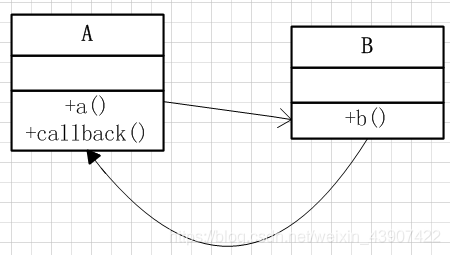

# 回调基本原理

**回调的思想是，类A的a()方法调用类B的b()方法，类B的b()方法执行完毕主动调用类A的callback()方法，这样一种调用方式可以看成是一种双向的调用方式。**

# 过滤器实现回调原理

Filter：过滤器实现的抽象接口

FilterChain：是回调接口

ApplicationFilter：过滤器实现

ApplicationFilterChain：控制回调的函数

FilterChain是回调接口，doFilter(request, response)是回调方法，ApplicationFilterChain是实现类，里面能得到实现了Filter接口的实现类xxxFilter（平常我们自己写过滤器就是实现Filte接口并重写doFilter方法），在doFilter(request, response)中执行中了某个Filter实现类的doFilter(request, response, this)方法，这里的this指的当前ApplicationFilterChain类，在这个方法执行某些处理后需要回调ApplicationFilterChain.doFilter(request, response)，这个回调会执行filter链中的下一个filter，一直循环到结束。因为ApplicationFilterChain是在回调方法里调用的各个filter的doFilter方法,而各个filter里又回调了ApplicationFilterChain的回调方法，所以会循环执行。

